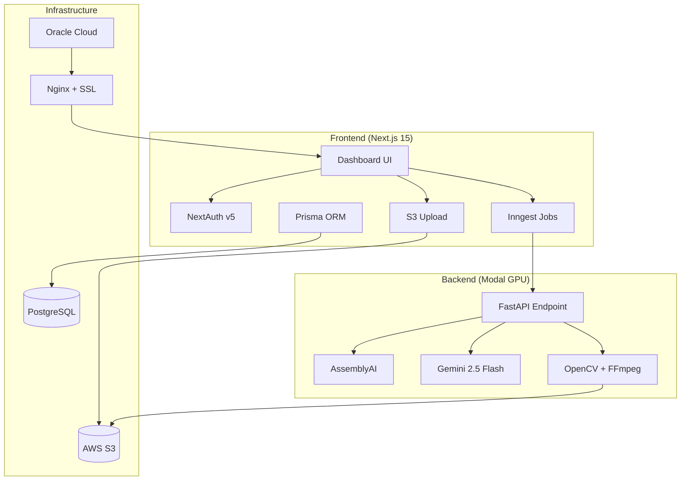

# ClippedAI

AI-powered video clipping platform that transforms long-form videos into viral-ready short clips with face tracking, smart cropping, and word-synced subtitles.

## Architecture



## Tech Stack

| Layer | Technology |
|-------|-----------|
| Frontend | Next.js 15, React 19, TailwindCSS v4, shadcn/ui |
| Auth | NextAuth v5 (credentials + JWT) |
| Database | PostgreSQL + Prisma ORM |
| Background Jobs | Inngest |
| Storage | AWS S3 |
| Backend | Python 3.10 on Modal (serverless GPU) |
| Transcription | AssemblyAI |
| AI Clip Selection | Groq (Llama 3.3 70B) |
| Video Processing | OpenCV, FFmpeg, scipy, scenedetect |
| Deployment | Docker Compose on Oracle Cloud, Nginx, Let's Encrypt |

## Local Development

### Prerequisites
- Node.js 18+
- Python 3.10+
- PostgreSQL
- Modal account
- AWS S3 bucket

### Frontend Setup
```bash
cd frontend
cp .env.example .env
# Fill in your environment variables
npm install
npx prisma generate
npx prisma db push
npm run dev
```

### Backend Setup
```bash
cd backend
cp .env.example .env
# Fill in your environment variables
pip install -r requirements.txt
modal deploy main.py
```

## Environment Variables

### Frontend (`frontend/.env`)

| Variable | Required | Description |
|----------|----------|-------------|
| `DATABASE_URL` | ✅ | PostgreSQL connection string |
| `AUTH_SECRET` | ✅ (prod) | NextAuth secret key |
| `AWS_ACCESS_KEY_ID` | ✅ | AWS credentials |
| `AWS_SECRET_ACCESS_KEY` | ✅ | AWS credentials |
| `AWS_REGION` | ✅ | S3 bucket region |
| `S3_BUCKET_NAME` | ✅ | S3 bucket name |
| `PROCESS_VIDEO_ENDPOINT` | ✅ | Modal backend endpoint URL |
| `PROCESS_VIDEO_ENDPOINT_AUTH` | ✅ | Bearer token for backend |
| `BASE_URL` | ✅ | App base URL (e.g. `https://clippedai.app`) |
| `STRIPE_SECRET_KEY` | ❌ | Stripe secret (optional) |
| `STRIPE_WEBHOOK_SECRET` | ❌ | Stripe webhook secret (optional) |

### Backend (`backend/.env`)

| Variable | Required | Description |
|----------|----------|-------------|
| `ASSEMBLYAI_KEY` | ✅ | AssemblyAI API key |
| `GEMINI_KEY` | ✅ | Google Gemini API key |
| `S3_BUCKET_NAME` | ✅ | S3 bucket name |
| `AWS_ACCESS_KEY_ID` | ✅ | AWS credentials |
| `AWS_SECRET_ACCESS_KEY` | ✅ | AWS credentials |
| `AUTH_TOKEN` | ✅ | Bearer token (must match frontend) |

## Deployment

Production deployment uses Docker Compose on Oracle Cloud with Nginx reverse proxy and Let's Encrypt SSL.

```bash
# Build and deploy
docker compose build
docker compose up -d
```

See [deploy.yml](.github/workflows/deploy.yml) for CI/CD configuration.

## License

MIT
