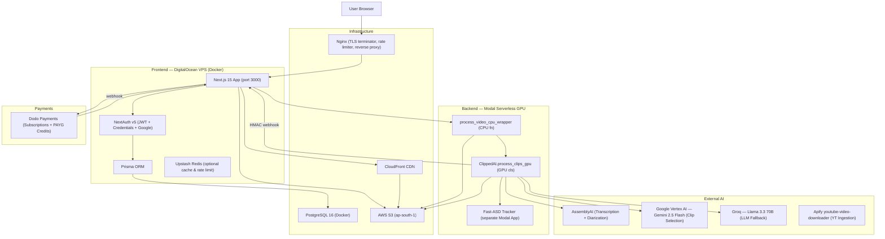

# ClippedAI — Complete System Analysis

## Executive Summary

ClippedAI is a **full-stack, AI-powered video clipping SaaS** that transforms long-form YouTube videos (or user uploads) into viral-ready 9:16 short-form clips. It operates as a two-tier system: a **Next.js 15 frontend** (subscription/billing, user auth, storage, job dispatch) and a **Python backend on Modal** (GPU-accelerated video AI pipeline). The two tiers are decoupled via an async webhook pattern — the frontend fires a job at Modal, then Modal calls back when finished.

---

## 1. High-Level Architecture



---

## 2. Repository Structure

```
ClippedAI/
├── backend/              # Python — Modal GPU pipeline
│   ├── main.py           # Modal app entry: FastAPI endpoint + CPU/GPU dispatchers
│   ├── config.py         # Env vars, logging, lazy API key accessors
│   ├── requirements.txt  # numpy, opencv, modal, boto3, apify-client, etc.
│   └── src/
│       ├── transcriber.py      # Phase 2: AssemblyAI (audio extract → upload → poll)
│       ├── llm.py              # Phase 3: Gemini 2.5-flash → Groq fallback
│       ├── video_processing.py # Phase 4–7: FFmpeg extract, OpenCV tracking, render
│       ├── signal_helpers.py   # Pure-logic smoothing/stabilization (unit-testable)
│       ├── subtitles.py        # Phase 6: ASS subtitle generation (karaoke style)
│       └── downloader.py       # Local-dev yt-dlp downloader (NOT used in production)
├── frontend/             # Next.js 15 — TypeScript
│   ├── prisma/schema.prisma    # 5 models: User, Account, Session, UploadedFile, Clip
│   ├── Dockerfile              # 3-stage: deps → builder → runner (standalone output)
│   └── src/
│       ├── app/                # Next.js App Router pages + API routes
│       ├── components/         # React components (app-shell, landing, ui/)
│       ├── server/auth/        # NextAuth config + Prisma adapter
│       ├── lib/                # cache.ts, monetization.ts, task-utils.ts, etc.
│       └── env.js              # @t3-oss/env-nextjs runtime env schema + validation
├── nginx/clippedai.conf  # Reverse proxy, TLS, CSP, rate-limiting
├── docker-compose.yml    # postgres + app services (DigitalOcean)
└── .github/workflows/
    └── deploy-do.yml     # CI/CD: build → GHCR → SSH rsync → docker compose up
```

---

## 3. Database Schema (Prisma / PostgreSQL)

| Model | Key Fields | Relations |
|-------|-----------|-----------|
| **User** | `id`, `email`, `password?`, `isAdmin`, `credits`, `dodoCustomerId?`, `dodoSubscriptionId?`, `dodoCurrentPeriodEnd?`, `dodoPlanId?`, `isFoundingMember`, `prefFont*` | has many `Account`, `Session`, `Clip`, `UploadedFile` |
| **UploadedFile** | `id`, `s3Key`, `displayName?`, `uploaded`, `status` (queued/uploading/processing/processed/failed), `userId` | belongs to `User`, has many `Clip` |
| **Clip** | `id`, `s3Key`, `thumbnailKey?`, `thumbnailKeys (JSON)?`, `clipTitle?`, `viralityScore?`, `uploadedFileId?`, `userId` | belongs to `UploadedFile`, `User` |
| **Account** | OAuth provider accounts | belongs to `User` |
| **Session** | NextAuth sessions | belongs to `User` |
| **VerificationToken** | Email verification | standalone |

**Indexes**: `UploadedFile` has composite indexes on `(userId, createdAt)` and `(userId, status)` for efficient dashboard queries.

---

## 4. Backend Pipeline — 7 Phases

The core processing pipeline lives entirely in the Modal GPU environment. Two separate Modal entities handle it with a CPU/GPU split to avoid holding GPUs idle during network-bound operations.

### Architecture: CPU → GPU Hand-off

```
HTTP POST /process_video (FastAPI)
    └─ spawn process_video_cpu_wrapper (CPU fn)
           ├─ YouTube? → Apify download → upload to S3
           └─ ClippedAI().process_clips_gpu.remote(dict)  (GPU cls)
                   └─ _process_video_pipeline(...)
                           ├─ Phase 1: Video Ingestion (S3 download)
                           ├─ Phase 2: Transcription (AssemblyAI)
                           ├─ Phase 3: LLM Clip Selection (Gemini 2.5-flash)
                           └─ Phase 4–7: Parallel clip processing (ThreadPoolExecutor, max 2)
                                   Per clip:
                                   ├─ Phase 4: extract_segment (FFmpeg, re-encode H264+AAC)
                                   ├─ Phase 5: track_speaker_and_frame (Fast-ASD + OpenCV)
                                   ├─ Phase 6: generate_subtitles (ASS karaoke file)
                                   └─ Phase 7: merge_and_cleanup (FFmpeg burn subtitles, mux audio → S3)
                   └─ _send_webhook (HMAC SHA-256 → /api/webhooks/modal)
```

### Phase 2: Transcription (`transcriber.py`)
- **Audio extraction first**: FFmpeg strips video to 48kbps mono Opus (`.ogg`), reducing upload to AssemblyAI by ~90%
- **Caching**: SHA-256 of video bytes → disk cache at `~/.clippedai/cache/transcript/`; cache hit skips AssemblyAI entirely
- **Payload**: `speech_models: ["universal-2"]`, `speaker_labels: True` — returns word-level timestamps + speaker IDs
- **Adaptive polling**: starts at 1s, exponentially backs off to 10s max; timeout scales with video duration (~200 + 50×per-10min attempts)

### Phase 3: LLM Clip Selection (`llm.py`)
- **Primary**: Gemini 2.5-flash via Google Vertex AI (GCP service account JSON injected from Modal secret)
- **Fallback**: Groq `llama-3.3-70b-versatile` (if Vertex unavailable or exhausted)
- **Prompt**: requests exactly 3 non-overlapping clips, 25–35s each, starting on hooks
- **Output**: `{clips: [{start_time, end_time, title, virality_score}]}`
- **Validation**: clips <20s auto-extended; clips >60s or OOB discarded
- **Caching**: SHA-256 of transcript prompt → disk cache; stable because transcript cache feeds stable LLM input

### Phase 5: Speaker Tracking & Adaptive Framing (`video_processing.py`)
This is the most algorithmically complex module — ~950 lines. Key design:

**Fast-ASD Integration**: Sends raw clip bytes to a separate Modal app (`fast-asd-tracker`) that runs TalkNet-based Active Speaker Detection. Returns per-frame `{frame_number, faces: [{x1,y1,x2,y2, speaking, raw_score}]}`.

**Multi-Speaker Layout Engine** (supports 1–4 speakers):

| Layout | Dimensions | Trigger |
|--------|-----------|---------|
| 1-speaker | 1080×1920 (full) | Default |
| 2-speaker | 1080×960 each (vertical split) | `MIN_SPLIT_2_ENTRY=20` frames |
| 3-speaker | 1080×960 top + 2×(540×960) bottom | `MIN_SPLIT_3_ENTRY=25` frames |
| 4-speaker | 2×2 grid, 540×960 each | `MIN_SPLIT_4_ENTRY=30` frames |

**Detection Hierarchy per frame**:
- A) TalkNet simultaneous speaking (highest confidence)
- B) Visual: ≥2 prominent, well-separated faces in confirmed multi-speaker scene
- C) Single TalkNet confirmed speaker
- C.5) Diarization-anchored fallback (AssemblyAI speaker ID → nearest face)
- D) Best-scoring detected face (last resort)

**Stabilization Pipeline**:
1. `_stabilize_bool_state` — 2-pass (min_entry / min_gap) noise suppression, globally across clip
2. `smooth_segment` — Gaussian smoothing of crop center; 3-tier: locked (stationary) → face-switching → truly moving
3. `stabilize_speaker_identity` — debounces camera angle cuts by requiring `MIN_SPEAKER_SWITCH_FRAMES` consecutive frames before committing crop switch; back-fills to make cut instantaneous once committed

### Phase 6: Subtitle Generation (`subtitles.py`)
- **Format**: `.ASS` (Advanced SubStation Alpha) — rendered by FFmpeg `libass` at merge
- **Karaoke effect**: active word highlighted in alternating yellow/cyan (`&H0000FFFF` / `&H0000FF00`), all others in user-selected color
- **Chunking**: max 3 words per chunk, split on punctuation or >300ms pause
- **Layout-aware positioning**: `\an5\pos(540,960)` override for split-screen frames
- **Custom fonts**: Komika Axis default; supports user-specified font families passed from frontend; fonts loaded via `fontsdir=` in ASS filter

### Phase 7: Merge & Cleanup (`video_processing.py`)
- Re-encodes MJPG tracked `.avi` (OpenCV output) → H.264 via `libx264` (never NVENC — MJPG pixel format incompatible)
- Burns in ASS subtitles via `libass`
- Muxes audio from Phase 4 extract
- Uploads final `.mp4` to S3 with `Cache-Control: public, max-age=31536000, immutable`

---

## 5. Frontend — API Route Map

### Public Routes
| Route | Method | Purpose |
|-------|--------|---------|
| `/` | GET | Landing page (v3 design: InteractiveHero + StickyNarrative + KineticTypography + VoidCTA) |
| `/pricing` | GET | Pricing page |
| `/login`, `/signup` | GET | Auth pages |

### Protected API Routes
| Route | Method | Auth | Purpose |
|-------|--------|------|---------|
| `/api/upload` | POST | ✅ Session | Upload video to S3; creates `UploadedFile` DB record |
| `/api/tasks/create` | POST | ✅ Session | Creates task, deducts 1 credit, fires Modal job async |
| `/api/tasks` | GET | ✅ Session | Lists user's tasks (30s Redis cache) |
| `/api/tasks/[id]` | GET | ✅ Session | Task detail + clip S3 presigned URLs (or CloudFront) |
| `/api/tasks/[id]` | DELETE | ✅ Session | Deletes task, S3 objects, and all clips (cascade) |
| `/api/tasks/[id]/retry` | POST | ✅ Session | Re-queues failed task, re-dispatches Modal |
| `/api/tasks/[id]/progress` | GET | ✅ Session | SSE stream; polls DB every 4s, max 2 min |
| `/api/tasks/cleanup` | POST | ✅ Admin | Bulk cleanup of stuck tasks |
| `/api/checkout` | POST | ✅ Session | Creates Dodo Payments subscription or one-time checkout link |
| `/api/preferences` | PATCH | ✅ Session | Updates user font preferences in DB |
| `/api/admin/*` | * | ✅ Admin | Admin dashboard endpoints |
| `/api/health` | GET | ❌ Public | Returns `{"status":"ok"}` for Docker healthcheck |

### Webhook Routes (No session, validated by signature)
| Route | Method | Validator | Purpose |
|-------|--------|-----------|---------|
| `/api/webhooks/modal` | POST | HMAC SHA-256 (shared secret) | Modal callback: creates clips in DB, updates status |
| `/api/webhooks/dodo` | POST | Dodo SDK signature | Payment events: credits, subscription activation/renewal/cancel |

---

## 6. Authentication System

**NextAuth v5** with JWT strategy + Prisma adapter:
- **Providers**: Credentials (email+bcrypt password) + Google OAuth
- **Session fields extended**: `id`, `isAdmin` baked into JWT at sign-in; avoids DB hit on every request
- **Admin gate**: `isAdmin` flag checked in API routes and middleware; also accepts `ADMIN_EMAIL` env var
- **Password handling**: nullable `password` field supports OAuth-created accounts
- **Rate limiting**: Upstash Redis sliding window (10 req/10s) applied in middleware to `/api/auth/*`, `/api/checkout`, `/api/webhooks`, `/api/feedback`

---

## 7. Monetization & Billing

### Credit System
- **1 credit = 1 minute of video** (conceptually; actually 1 credit per task, regardless of video length)
- Credits are atomic: `updateMany` with `where: { credits: { gt: 0 } }` prevents race conditions
- On Modal dispatch failure after credit deduction: credit is refunded via `{ increment: 1 }`
- Admins, local dev, and test admin email bypass all billing checks

### Dodo Payments Integration
| Product Type | Env Vars | Action |
|-------------|----------|--------|
| Subscription: Starter | `DODO_PLAN_STARTER` | 20 credits/month |
| Subscription: Pro | `DODO_PLAN_PRO` | 200 credits/month |
| Subscription: Founding Member | `DODO_PLAN_PRO_FOUNDING` | 200 credits/month + `isFoundingMember=true` (permanent) |
| Credit Pack: 100 | `DODO_CREDITS_100` | +100 credits (one-time) |
| Credit Pack: 250 | `DODO_CREDITS_250` | +250 credits (one-time) |
| Credit Pack: 500 | `DODO_CREDITS_500` | +500 credits (one-time) |

**Webhook events handled**:
- `payment.succeeded` → credit pack purchase (adds credits)
- `subscription.active` / `subscription.renewed` → monthly credit replenishment
- `subscription.cancelled` → clears `dodoSubscriptionId` (credits retained)

**Checkout flow**: `/api/checkout` → Dodo SDK creates subscription or one-time payment link → redirects user → Dodo fires webhook → `/api/webhooks/dodo` → DB update.

---

## 8. Storage & CDN

### AWS S3
- **Bucket**: `clippedai-ap-south-1` (default, overridable via env)
- **S3 Key Structure**:
  - User uploads: `{userId}-{uuid}/original.mp4`
  - YouTube downloads: `youtube-downloads/{userId}-{timestamp}/{videoId}/original.mp4`
  - Output clips: `{folder}/clip_{n}.mp4` (same dir as input)
- **Upload**: multipart via `@aws-sdk/lib-storage` Upload (supports files up to 500MB)
- **Download**: presigned URLs (1hr expiry) via `@aws-sdk/s3-request-presigner`; or CloudFront if `NEXT_PUBLIC_CLOUDFRONT_DOMAIN` is set
- **Cache headers on clips**: `public, max-age=31536000, immutable`

### CloudFront
- Optional CDN layer for clips and thumbnails
- `shouldUseCloudFront()` checks if `NEXT_PUBLIC_CLOUDFRONT_DOMAIN` is defined — completely replaces presigned URLs when active
- URL format: `https://{domain}/{key}?v=1`

---

## 9. Caching Layer

### Upstash Redis (Optional)
- **Task list cache**: `tasks:{userId}` key, 30s TTL; invalidated on task create, retry, and webhook receipt
- **Upload rate limit**: `rate_limit:upload:{userId}` key with 1hr window, max 15 uploads; falls back to DB count if Redis unavailable
- **Middleware rate limit**: Sliding window 10 req/10s per IP for sensitive routes

### Backend Disk Cache (Modal `/tmp` is ephemeral; uses home dir)
- **Transcript cache**: `~/.clippedai/cache/transcript/transcript_{sha256}.json`
- **LLM cache**: `~/.clippedai/cache/llm/llm_{sha256}.json`

> [!WARNING]
> These disk caches are stored relative to the Modal container's home directory. Since Modal containers are ephemeral, caches only benefit within a single warm container's lifetime. They do NOT persist across cold starts.

---

## 10. Deployment Pipeline

### CI/CD Flow (`deploy-do.yml`)
```
git push to main
    → GitHub Actions (ubuntu-latest)
        1. Build Docker image (frontend/Dockerfile, 3-stage)
        2. Push → ghcr.io/ets2k7/clippedai-app:latest
        3. Write .env.production (from GitHub Secrets)
        4. rsync code to /opt/clippedai/ (excludes .env*, node_modules, .next)
        5. scp .env.production + root .env to server
        6. SSH: docker compose pull app → docker compose up -d
        7. Health check via SSH curl to localhost:3000/api/health
        8. Sync nginx config + reload
```

### Nginx Configuration
- **TLS**: Let's Encrypt, TLSv1.2+, HSTS, full security header suite (X-Frame-Options, CSP, etc.)
- **CSP**: Allows `unsafe-inline` for scripts (Next.js requirement); explicitly allowlists CloudFront domain for media
- **Upload limit**: `client_max_body_size 500M`
- **Rate limit zones** (defined in `conf.d/rate-limits.conf`):
  - `auth_limit`: `/api/auth/(signin|callback)` — burst 5
  - `api_limit`: all `/api/` — burst 50
  - `feedback_limit`: `/api/feedback` — burst 2
- **SSE support**: `proxy_buffering off`, 3600s read/send timeout for `/api/` (required for progress stream)

### Docker Compose (Production)
| Service | Image | Port | Config |
|---------|-------|------|--------|
| `db` | `postgres:16-alpine` | `127.0.0.1:5432` | Health checked |
| `app` | `ghcr.io/ets2k7/clippedai-app:latest` | `127.0.0.1:3000` | Startup runs `prisma migrate deploy` then `node server.js`; 2 CPU / 2GB memory limit |

---

## 11. Modal Backend Configuration

```python
# GPU class (ClippedAI)
@app.cls(
    gpu="any",          # Any available GPU type
    timeout=1200,       # 20 min max
    scaledown_window=15, # Aggressive idle shutdown (prevent credit leakage)
    max_containers=10,  # Hard cap on simultaneous GPU tasks
    retries=0,          # No automatic retries (avoid double-billing)
    secrets=[
        modal.Secret.from_name("clippedai-secret"),  # AWS, AssemblyAI, AUTH_TOKEN
        modal.Secret.from_name("my-gcp-secret"),     # GCP service account JSON
    ]
)

# CPU wrapper function
@app.function(
    timeout=1200,
    max_containers=20,  # Higher limit (CPU is cheaper)
    retries=0,
    secrets=[...same...]
)
```

**Image build** (`modal.Image.debian_slim`):
- `ffmpeg`, `libgl1-mesa-glx`, `libsm6`, `libxext6` (OpenCV deps), `fontconfig`
- Python packages from `requirements.txt`
- `apify-client` (pip_install extra)
- `src/` dir, `fonts/` dir (custom .ttf files), `config.py` copied into container

**NVENC detection**: Run at container startup in `@modal.enter()`, cached as `self._has_nvenc`. Also re-detected in `_process_video_pipeline()` for the CLI path.

---

## 12. Security Architecture

| Layer | Mechanism |
|-------|-----------|
| Auth | NextAuth JWT (15min default expiry implied); `isAdmin` baked into token |
| API access | All non-public routes require valid session |
| Upload gate | Currently admin-only in production (`user?.isAdmin`) |
| Rate limiting | Dual-layer: Nginx (IP-based) + Upstash Redis (user-based) |
| File validation | MIME type allowlist + magic byte check (12-byte header) + 500MB cap |
| Modal auth | Bearer token (`AUTH_TOKEN`) validated with `hmac.compare_digest` |
| Modal webhook | HMAC SHA-256 signature on raw body; timing-safe comparison |
| Dodo webhook | Dodo SDK signature verification (`webhooks.unwrap`) |
| YouTube URL injection | Strict regex match for video ID; URL canonicalized before use |
| yt-dlp injection (local) | `startswith` check for `https://www.youtube.com/` or `https://youtu.be/` |

---

## 13. Key Observed Patterns & Design Decisions

### Async Webhook Pattern
The frontend **never waits** for the Modal GPU job to complete. `/api/tasks/create` fires the job in a `void (async () => {})()` background promise and returns `{task_id}` immediately. The browser then subscribes to `/api/tasks/[id]/progress` SSE which polls the DB every 4s until status changes.

### Credit Safety Net
The `updateMany` with `where: { credits: { gt: 0 } }` pattern is a distributed lock substitute — it ensures credits can't go negative even under concurrent requests, because the count returned tells you whether the decrement succeeded.

### CPU/GPU Split Architecture
YouTube downloads are intentionally offloaded to a CPU-only Modal function to avoid holding expensive GPU containers idle during network I/O (Apify API calls + S3 upload can take minutes). The GPU container only starts after the video is already on S3.

### S3 404 Recovery
If an S3 download returns 404 for a `youtube-downloads/` key, the pipeline reconstructs the YouTube URL from the key path and re-downloads via Apify. This makes the system resilient to prior failed uploads.

### Clip-Level Parallelism
Up to 2 clips process concurrently via `ThreadPoolExecutor(max_workers=2)`. The cap prevents GPU memory exhaustion. Each clip failure is isolated — partial success returns completed clips.

### Subtitle Layout Awareness
The subtitle engine receives `chunk_meta` from Phase 5 — a list of `{start_ms, end_ms, flag}` where `flag` is `"SINGLE"` or `"SPLIT"`. Split-screen frames get `\an5\pos(540,960)` override to center subtitles between the two speaker cells.

---

## 14. Known Gaps & Potential Issues

> [!WARNING]
> **Upload gate is admin-only**: In production, the `/api/upload` endpoint rejects non-admin users with a 403. This is intentional (beta access control) but blocks general user access.

> [!NOTE]
> **Modal disk cache is ephemeral**: The transcript and LLM caches only survive within a single container warm period. Cold starts always re-call AssemblyAI and the LLM.

> [!NOTE]
> **SSE progress is estimate-only**: `/api/tasks/[id]/progress` calculates progress as `elapsed / 3min`, capped at 90%. The 100% event only fires when the webhook is received and DB status changes to `processed`.

> [!NOTE]
> **Font file shipping**: Custom fonts (Komika Axis, TikTokSans, etc.) are bundled into the Modal image via `add_local_dir("fonts", ...)`. Any font addition requires `modal deploy`.

> [!CAUTION]
> **Retry endpoint re-uses original s3Key**: When retrying, the old clip S3 objects are deleted from the DB but NOT from S3. New clips will use different keys and won't collide, but old orphaned S3 objects accumulate.

> [!NOTE]
> **Founding Member status is permanent**: The `isFoundingMember` field is set to `true` on first activation and never unset, even if the user cancels and re-subscribes to a non-founding plan.

---

## 15. Tech Stack Summary Table

| Layer | Technology | Version |
|-------|-----------|---------|
| Frontend framework | Next.js | 15.x (App Router) |
| UI library | React | 19.0 |
| Styling | TailwindCSS v4 | 4.x |
| UI components | shadcn/ui (Radix UI) | Latest |
| Animations | Framer Motion | 12.x |
| Auth | NextAuth v5 | 5.0.0-beta.25 |
| Database ORM | Prisma | 5.22 |
| Database | PostgreSQL | 16 |
| Payments | Dodo Payments SDK | 2.28.2 |
| Cache / Rate limit | Upstash Redis | 1.37 |
| File storage | AWS S3 | SDK v3 |
| CDN | AWS CloudFront | — |
| Backend runtime | Python 3.10 on Modal | modal 0.73 |
| API framework | FastAPI (via Modal) | 0.115 |
| GPU video processing | OpenCV | 4.9 |
| Video muxing | FFmpeg | System |
| GPU acceleration | NVENC (h264_nvenc) | w/ CPU fallback |
| Scene detection | PySceneDetect | 0.6.3 |
| Signal processing | SciPy | 1.13 |
| Transcription | AssemblyAI | 0.37 |
| Speaker tracking | Fast-ASD / TalkNet | (separate Modal app) |
| LLM (primary) | Gemini 2.5-flash (Vertex AI) | google-genai ≥1.0 |
| LLM (fallback) | Groq Llama 3.3 70B | REST API |
| YouTube ingestion | Apify (streamers/youtube-video-downloader) | apify-client 1.6.4 |
| Container registry | GitHub Container Registry (GHCR) | — |
| Hosting | DigitalOcean VPS | Docker Compose |
| Reverse proxy | Nginx | TLSv1.2/1.3 |
| TLS | Let's Encrypt | — |
| CI/CD | GitHub Actions | — |
| Analytics | Datafast, PostHog | — |
